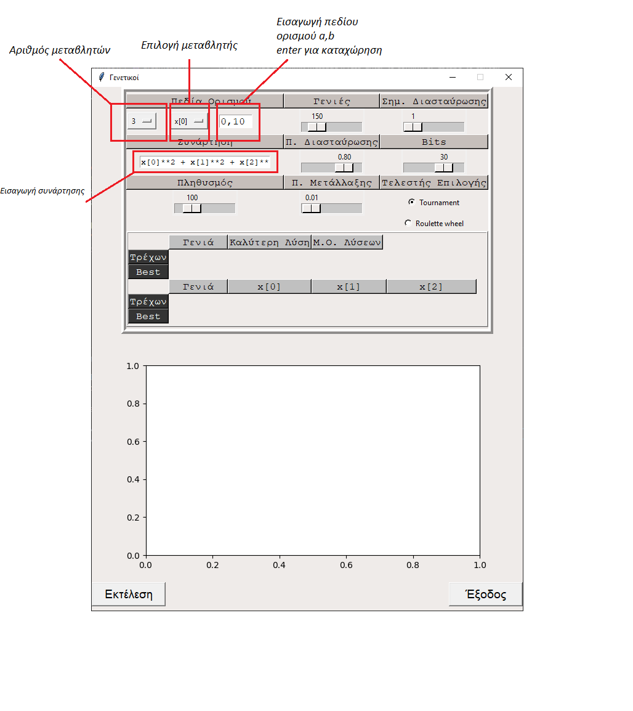
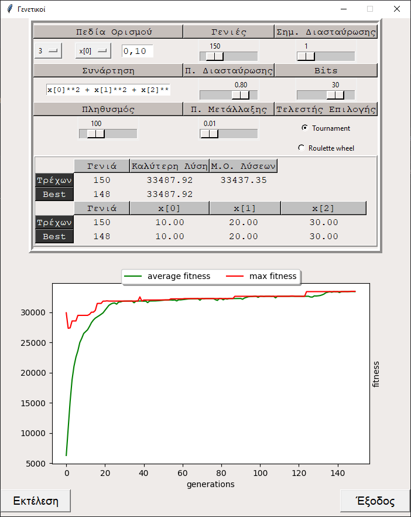

# Εύρεση μεγίστου συνάρτησης με χρήση γενετικών αλγορίθμων

## Getting Started 
Windows:

```cmd
git clone https://github.com/gk2803/project01_ga.git
pip instal virtualenv
virtualenv venv
venv\Scrips\activate
pip install -r requirements.txt
python main.py
```

Linux/Mac:
```cmd
git clone https://github.com/gk2803/project01_ga.git
pip install virtualenv
virtualenv venv 
source venv/bin/activate
pip install -r requirements.txt
python main.py
```
## Demonstration


Μέγιστο της συνάρτησης 
στα 





## Execution Example 

